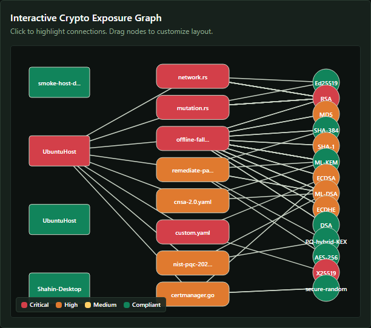
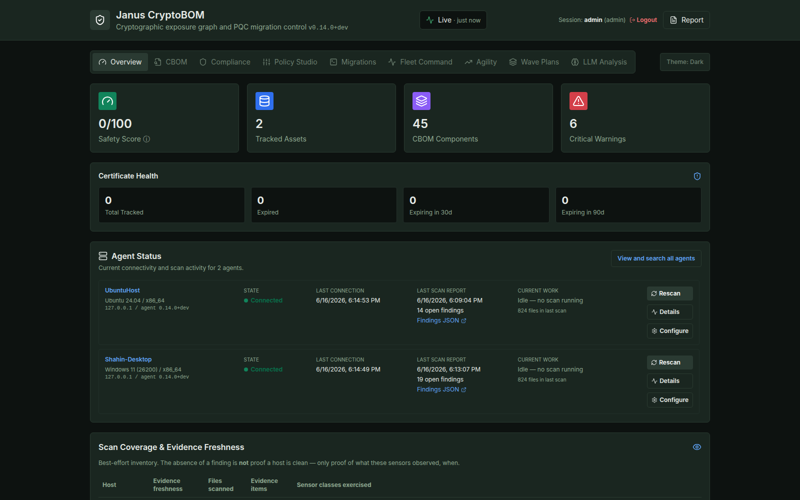
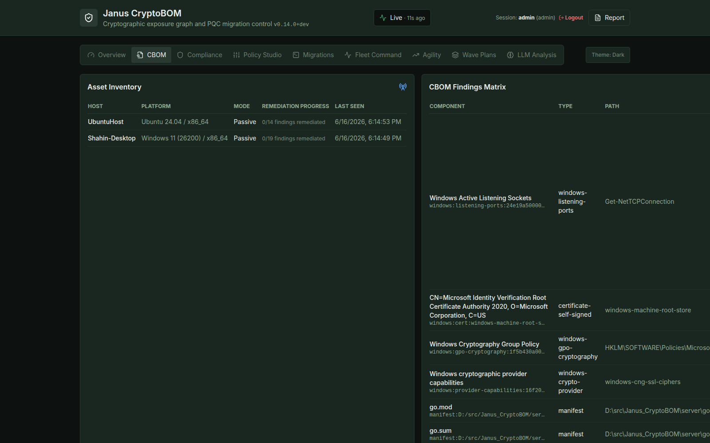
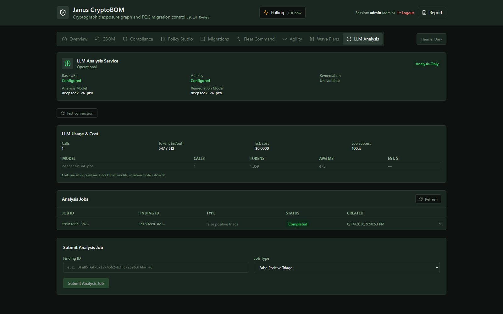

# Janus CryptoBOM: Enterprise Post-Quantum Cryptographic Posture Management & Migration Suite

Janus CryptoBOM is an enterprise post-quantum cryptographic posture management (PQC-PM), discovery, and automated migration platform. It enables organizations to discover legacy cryptographic vulnerabilities, assess quantum readiness, align with emerging standards, and orchestrate safe, automated migrations to Post-Quantum Cryptography (PQC).

> **New here?** Jump to [Getting Started](#getting-started), then follow [`docs/QUICKSTART.md`](docs/QUICKSTART.md). For the full picture, see the [Documentation](#documentation) index. The canonical release version is tracked in [`VERSION.env`](VERSION.env).

---

## Table of Contents
- [Executive Briefing: The Post-Quantum Business Risk](#executive-briefing-the-post-quantum-business-risk)
- [The Janus Value Proposition](#the-janus-value-proposition)
- [Enterprise Dashboard](#enterprise-dashboard)
- [Direct Comparison Matrix](#direct-comparison-matrix)
- [Competitive Analysis & Strategic Roadmap](#competitive-analysis--strategic-roadmap)
- [Platform Architecture](#platform-architecture)
- [Getting Started](#getting-started)
- [Safety Model & Security Controls](#safety-model--security-controls)
- [Platform Support](#platform-support)
- [Observability & Real-Time Updates](#observability--real-time-updates)
- [API & Integration](#api--integration)
- [Capability Maturity](#capability-maturity)
- [Documentation](#documentation)
- [License](#license)

---

## Executive Briefing: The Post-Quantum Business Risk

### The Quantum Threat (Shor's Algorithm)
Symmetric and asymmetric encryption form the bedrock of trust for modern enterprise infrastructure. However, the development of cryptanalytically relevant quantum computers (CRQCs) threatens to dismantle this foundation. Shor's algorithm demonstrates that a quantum computer of sufficient scale will solve prime factorization and discrete logarithms in polynomial time, rendering legacy public-key cryptosystems — including RSA, Diffie-Hellman, ECDH, and ECDSA — completely obsolete.

### Harvest Now, Decrypt Later (HNDL)
This threat is not futuristic; it is active today. Hostile state actors and sophisticated syndicates are executing "Harvest Now, Decrypt Later" (HNDL) operations. Adversaries intercept and store encrypted enterprise and government communications today, waiting to decrypt them once quantum computers reach sufficient capability.

### Regulatory Alignment (NIST FIPS 203/204/205 + CNSA 2.0)
Global standards are rapidly adapting to enforce PQC transition timelines:
- **NIST FIPS 203**: ML-KEM (Module-Lattice-Based Key-Encapsulation Mechanism) for key establishment.
- **NIST FIPS 204**: ML-DSA (Module-Lattice-Based Digital Signature Algorithm) for digital signatures.
- **NIST FIPS 205**: SLH-DSA (Stateless Hash-Based Digital Signature Algorithm) for digital signatures.
- **CNSA 2.0**: Mandates ML-KEM-1024, ML-DSA-87, AES-256, SHA-384 minimums, and P-384 minimum for ECDSA.

Janus supports both NIST PQC 2026.1 and CNSA 2.0 compliance profiles, with CNSA-specific assessment rules that flag insufficient curves, hash algorithms, and symmetric ciphers.

---

## The Janus Value Proposition

1. **Post-Quantum Cryptographic Posture Management (PQC-PM)**: Complete visibility across codebases, compiled binaries, OS trust stores, network protocol suites, and process memory footprints.
2. **Context-Aware Semantic Intent Analysis**: AST-based semantic analysis distinguishes active cryptographic protection from legacy verification-only paths, reducing SOC alert fatigue. Optional LLM-powered intent classification provides higher confidence.

   > **Experimental (not production-ready):** LLM intent classification requires a separately configured OpenAI-compatible provider (`JANUS_LLM_BASE_URL`, with the API key supplied via `JANUS_LLM_API_KEY_ENV` or `JANUS_LLM_API_KEY_FILE`). When no provider is configured the agent falls back to offline heuristics only. LLM-generated results are proposals requiring human review and must not be used as the sole basis for production remediation decisions. See [`docs/ARCHITECTURE.md`](docs/ARCHITECTURE.md) §8 *LLM capability & safety contract*.
3. **Automated Sandboxed Migration**: Signed, atomic migration directives with automated backup, validation, reload, TLS verification, and rollback.

---

## Enterprise Dashboard

The React dashboard is the operator's control plane — a real-time, light/dark-themeable SPA over the server's REST + WebSocket API. It opens on an **Overview** that aggregates the fleet's Safety Score, tracked assets, CBOM component count, critical findings, certificate health, and per-agent status, and maps host → component → algorithm relationships in an interactive crypto-exposure graph. Nine tabs cover the full workflow: Overview, CBOM, Compliance Matrix, Policy Studio, Migrations, Fleet Command, Agility, Wave Plans, and LLM Analysis.

A tab-by-tab walkthrough with role permissions is in [`docs/GUIDE.md`](docs/GUIDE.md) §5 *Roles & user manual*. The screenshots below are from a live `0.14.0` instance; to refresh them after UI/data changes, follow [`docs/images/CAPTURE.md`](docs/images/CAPTURE.md).

### Interactive Crypto Exposure Graph
Maps host → component → algorithm relationships, with nodes colored by severity (Critical / High / Medium / Compliant). Click to highlight a node's connections; drag to recustomize the layout.

### Overview — fleet posture at a glance

### CBOM — asset inventory & cryptographic bill of materials

### LLM Analysis — optional AI triage with usage & cost tracking

---

## Direct Comparison Matrix

| Competitor / Suite | Discovery Mode | Network Sweep | Cert Management | Active Migration | Memory Scraping | EDR Impact |
| :--- | :--- | :--- | :--- | :--- | :--- | :--- |
| **Janus CryptoBOM** | **Yes** (Source, binary, dependencies, configurations) | **Yes** (Agent-based + agentless network socket + STARTTLS probing) | **Yes** (Schannel, Java TrustStore, Windows certutil/CAPI/CNG) | **Yes** (Atomic with HMAC-signed directives, validation, reload, rollback) | **Yes** (Windows ReadProcessMemory + Linux /proc/PID/mem) | **High** (Whitelisting recommended for active mode) |
| **PQCA CBOMkit** | **Yes** (Source via SonarQube) | **No** | **No** | **No** | **No** | **None** |
| **cdxgen** | **Yes** (Source + dependency SCA) | **No** | **No** | **No** | **No** | **None** |
| **QRAMM CSNP** | **Yes** (CLI source for 50+ algos) | **Yes** (TLS-Analyzer active sweep) | **No** | **No** | **No** | **Low** |
| **SandboxAQ AQtive Guard** | **Yes** (Source, filesystem, binary) | **Yes** (Cloud/network sensors) | **No** | **Partial** (Config alerts) | **Yes** (Runtime env inspection) | **Medium** |
| **Keyfactor AgileSec** | **Partial** (Weak key detection) | **Yes** (Network/endpoint scanner) | **Yes** (Certificate lifecycle) | **Yes** (PKI upgrade, hybrid certs) | **No** | **Low-Medium** |
| **IBM zCDI** | **No** | **Yes** (Mainframe network analysis) | **Partial** (Audit log aggregation) | **No** | **No** | **None** |
| **Thales PQC Agility** | **No** | **No** | **Yes** (HSM + KM connectors) | **Partial** (HSM key transitions) | **No** | **Low** |

---

## Competitive Analysis & Strategic Roadmap

Janus is compared against 10 enterprise PQC platforms (SandboxAQ, Keyfactor, IBM, Thales, PQShield, QuSecure, Crypto4A, DigiCert, Entrust, ISARA/Cisco) plus open-source alternatives — see the Direct Comparison Matrix above.

Key findings:
- **Janus has the broadest discovery surface** (7 modalities vs. max 4 for competitors)
- **Only platform with HMAC-signed safe migration** with atomic rollback
- **Only open-source PQC posture management platform** (Apache 2.0)
- **Only platform with process memory private key detection** (Windows + Linux)
- 24 prioritized feature recommendations across 4 tiers to extend the lead

---

## Platform Architecture

Janus CryptoBOM is divided into four main layers connected via a single protobuf contract:

- **React SPA Dashboard (`ui/`)**: TypeScript SPA using React, Tailwind CSS, and CSS custom properties for light/dark theming. Provides real-time posture monitoring via WebSocket, policy configuration, migration orchestration, fleet management, and advanced settings.
- **Go Server (`server/` and `cmd/janus-server/`)**: Control plane managing agent registration, CBOM telemetry aggregation over gRPC, policy evaluation against PostgreSQL, migration command queuing with HMAC-signed directives, REST API with JWT authentication, WebSocket hub for real-time updates, structured logging via `log/slog`, and SIEM webhook dispatch with circuit breaker and retry logic.
- **Rust Endpoint Agent (`agent/`)**: High-performance daemon running on Windows, Linux, and macOS. Executes scheduled passive scans (source, binary, dependency, runtime memory, Windows registry, plugin), generates CycloneDX v1.6 CBOM outputs, enforces resource limits on plugins via cgroups/Job objects, and executes signed active mutation instructions with atomic rollback.
- **Protobuf Contracts (`proto/janus.proto`)**: Canonical definitions of the bidirectional streaming gRPC protocol linking agents to the server, with cryptographically signed directives for secure control transactions.

A per-package breakdown of the server (`config`, `store`, `grpcserver`, `httpapi`, `policy`, `orchestrator`, `certmanager`, `ws`, …) and a module-by-module map of the agent (`discovery/*`, `comms`, `mutation`, `storage`, `interceptor`, …) are maintained in [`docs/ARCHITECTURE.md`](docs/ARCHITECTURE.md) §1 *System architecture*, alongside the agent–server protocol (§2) and data model (§3).

---

## Getting Started

Janus ships three supported deployment paths — **Docker Compose**, **portable bundles** (copy-and-run, no toolchain), and **native/local install** (build from source) — plus a server-less **CI gate** that runs the agent's `check` subcommand against a codebase. The control plane needs a PostgreSQL database and a `JANUS_COMMAND_SIGNING_KEY` (32-byte hex, no default — generate with `janus-server gen-hmac-key`, no external tools); the agent runs passive-only until explicitly switched to active mode.

Pick a path and follow it end to end in [`docs/QUICKSTART.md`](docs/QUICKSTART.md) — §0 *Prerequisites*, §A *Docker Compose*, §B *Portable bundles*, §C *Native / local install*, *Serving the dashboard*, and *Use Janus in CI*. For production deployment topologies, installation playbooks, and the complete settings/environment-variable reference, see [`docs/GUIDE.md`](docs/GUIDE.md) §2–§4. Building from source (MSBuild on Windows, `make` on Linux/macOS) is covered in [`docs/QUICKSTART.md`](docs/QUICKSTART.md) §C *Native / local install*.

---

## Safety Model & Security Controls

Active migration is **off by default**: the agent is passive-only until an operator sets active mode, and every mutation command must carry a valid HMAC-SHA256 `signed_directive`. The HMAC key can be held in an HSM (`JANUS_HSM_SIGN_COMMANDS`), and an optional asymmetric layer (`JANUS_COMMAND_SIG_SCHEME=ml-dsa`) has the server sign commands with **ML-DSA (FIPS 204)** while agents verify against an operator-pinned public-key fingerprint — so a compromised agent cannot forge commands, and stripping the signature is rejected (downgrade-resistant), and a configurable replay window rejects stale or future-dated commands. Configuration changes are sandboxed to operator-approved `allowed_config_roots` with a file-extension **allowlist**, applied atomically (backup → write → validate → reload → TLS verify → auto-restore on any failure), and protected against config drift via SHA-256 checksum comparison. Secrets never ship with defaults — `JANUS_COMMAND_SIGNING_KEY` is required at startup — and the agent's offline queue is encrypted at rest (DPAPI on Windows, authenticated AES-256-GCM on Linux). Dashboard sessions use JWT auth with origin-restricted CORS, and state-changing admin actions require operator/admin (viewers are read-only); critical-finding webhooks dispatch through a retrying circuit breaker; and external plugins run under OS-enforced resource limits (cgroups v2 / Job objects).

The full control list, trust boundaries, and adversary assumptions are documented in [`docs/ARCHITECTURE.md`](docs/ARCHITECTURE.md) §9 *Security architecture & threat model*, with data handling in §10 *Privacy & data governance*. Vulnerability reporting and supported versions are in [`SECURITY.md`](SECURITY.md).

---

## Platform Support

Janus runs on Windows, Linux, and macOS, with the deepest integrations on Windows — certificate stores (`certutil` / PowerShell), CNG and CryptoAPI (CAPI) provider mapping, HTTP.sys SSL binding sweeps (`netsh http show sslcert`), Schannel registry enforcement, DPAPI secret shielding, and process-memory private-key detection via `ReadProcessMemory`. On Linux, memory scanning uses `/proc/PID/maps` + `/proc/PID/mem`, encryption keys derive from machine identity, and plugins are constrained with cgroups v2.

The per-platform support matrix — including which discovery modules require elevation and which are Windows-only — is in [`docs/GUIDE.md`](docs/GUIDE.md) §6 *Platform support*.

---

## Observability & Real-Time Updates

The server emits structured JSON logs (`log/slog`, level via `JANUS_LOG_LEVEL`) and the agent logs via the `tracing` crate (`RUST_LOG`). Operational signals include a Prometheus `/metrics` endpoint (asset/finding/migration gauges, optionally bearer-token protected), a JSON-lines SIEM export at `/api/export/siem`, agent HTTP heartbeats every 5 seconds (scan progress, CPU, memory, phase) with stalled-agent detection, and a dashboard WebSocket at `/api/ws` that streams `telemetry_update`, `finding_status`, `migration_enqueued` / `migration_status`, and `policy_switched` events.

Metrics, dashboards, log fields, and routine maintenance (retention, VACUUM, backups) are detailed in [`docs/GUIDE.md`](docs/GUIDE.md) §13 *Observability & maintenance*.

---

## API & Integration

The Go server exposes a JSON REST API (JWT bearer auth, obtained via `POST /api/auth/login`) plus a WebSocket event stream, covering fleet inventory, findings triage, policy management, migration orchestration, wave planning, crypto-agility scoring, exports (CycloneDX 1.6, SARIF 2.1.0, CSV, SIEM), and agent ingest. The protobuf contract for agent↔server streaming lives in [`proto/janus.proto`](proto/janus.proto).

The complete endpoint catalog — methods, paths, roles, request/response shapes, and `curl` examples — is in [`docs/API_REFERENCE.md`](docs/API_REFERENCE.md) (see *Authentication* and *Conventions* first, then the per-area sections). REST design notes and the data model are in [`docs/ARCHITECTURE.md`](docs/ARCHITECTURE.md) §4 *HTTP REST API*. To extend discovery with your own scanners, see [`docs/PLUGIN_GUIDE.md`](docs/PLUGIN_GUIDE.md).

---

## Capability Maturity

Janus is honest about feature maturity: most **discovery** capabilities (source, binary, dependency, network/PKI, Windows cert-store, process-memory, CBOM/SARIF export, control pack) are **Experimental**, and the **orchestration** capabilities (wave planning, agility scorecard, LLM analysis, sandbox simulation, active migration, HSM/PKCS#11) are **Prototype**. Treat anything marked Experimental or Prototype as decision-support only — **do not** use it as the sole basis for autonomous production remediation without manual review.

The full maturity table with per-feature caveats and graduation criteria is in [`docs/GUIDE.md`](docs/GUIDE.md) §9 *Capability maturity framework*.

---

## Documentation

| Document | Covers |
|---|---|
| [`docs/QUICKSTART.md`](docs/QUICKSTART.md) | Get running in minutes — Docker / portable / native, dashboard serving, CI usage, troubleshooting |
| [`docs/GUIDE.md`](docs/GUIDE.md) | Complete operator guide — deployment topologies, installation playbooks, settings reference, roles, platform support, HSM, capability maturity, wave planning, observability & maintenance, versioning |
| [`docs/ARCHITECTURE.md`](docs/ARCHITECTURE.md) | Architecture & technical reference — system design, agent–server protocol, data model, REST API, policy engine, network/PKI assessment, migration matrix, LLM safety contract, threat model, privacy |
| [`docs/API_REFERENCE.md`](docs/API_REFERENCE.md) | Full HTTP/WS API catalog with examples |
| [`docs/openapi.yaml`](docs/openapi.yaml) | Machine-readable OpenAPI 3.0 spec (Swagger UI / Postman / codegen) |
| [`docs/PLUGIN_GUIDE.md`](docs/PLUGIN_GUIDE.md) | Writing, configuring, and testing agent discovery plugins |
| [`docs/TROUBLESHOOTING.md`](docs/TROUBLESHOOTING.md) | Runbook — common startup/auth/agent/migration/HSM/build errors and fixes |
| [`SECURITY.md`](SECURITY.md) | Security policy, supported versions, vulnerability reporting |
| [`SUPPORT.md`](SUPPORT.md) | Support tiers and deprecation policy |

The canonical release version is defined in [`VERSION.env`](VERSION.env) and injected into binaries at build time.

---

## License

Janus CryptoBOM is distributed under the Apache License, Version 2.0. See the [Apache License, Version 2.0](https://www.apache.org/licenses/LICENSE-2.0) for full details.
