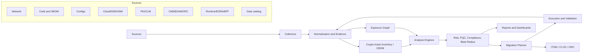

# Crypto Infrastructure Analyzer Benchmark and Solution Design

Date: 2026-06-03

Scope: analysis of the local sample artifacts plus a public-source benchmark of commercial and open-source tools for enterprise cryptographic discovery, vulnerability analysis, crypto-agility, and post-quantum cryptography (PQC) migration planning.

Local artifacts reviewed:

- `academique-dmz-synchro-umontreal-ca-38dae28e.pdf`
- `photo_2026-06-02_18-09-00.jpg`

Important caveat: this is a desk benchmark based on the local artifacts and public documentation. It is not a hands-on procurement bake-off against vendor trial environments.

## 1. Executive Takeaway

The sample analyzer already resembles a cryptographic posture management and PQC migration platform rather than a simple TLS scanner. It produces executive risk scoring, finding registers, migration waves, blast-radius/dependency analysis, compliance claim gates, ownership, rollback guidance, and a graph model.

The best commercial analogues are SandboxAQ AQtive Guard, Keyfactor/InfoSec Global cryptographic discovery, AppViewX Quantum Trust Hub, CryptoNext COMPASS, IBM Quantum Safe, DigiCert Trust Lifecycle Manager, Wiz PQC Readiness, Entrust, Thales, and QuSecure. None of the open-source tools alone provides the full capability. A credible open-source stack must combine active/passive network scanners, static code crypto analyzers, CBOM/SBOM generation, a graph database, policy-as-code, runtime validation, and PQC lab tooling such as OpenSSL 3.5 and Open Quantum Safe.

The recommended target architecture is a "cryptographic exposure graph" platform:

1. Discover cryptography across network, code, configs, certificates, cloud, containers, KMS/HSM, storage, identity, API gateways, and OT.
2. Normalize evidence into a CBOM-compatible inventory.
3. Build a graph of assets, keys, certs, algorithms, protocols, data classes, owners, dependencies, findings, and migration actions.
4. Score classical vulnerabilities and quantum exposure separately.
5. Generate migration waves with compatibility validation, canary controls, rollback, and audit evidence.
6. Continuously monitor drift and gate new deployments through CI/CD and policy-as-code.

## 2. Sample Artifact Analysis

### 2.1 PDF Report

The PDF is a 24-page "QuantumGuard Bridge Enterprise PQC Readiness Report" for:

- Tenant: Arya
- Scan ID: `38dae28e-b47d-40f5-84d5-cfdbeb774fb5`
- Target: `academique-dmz.synchro.umontreal.ca`
- Date: 2026-05-28 18:26 UTC
- Scope: network target with 3 in-scope assets
- PQC readiness score: 0/100
- Severity: Vulnerable
- Quantum risk score: 76/100, High
- Threat model: nation-state, store-now-decrypt-later, long-term passive
- Client impact: browser high, mobile medium, API low

Detected assets and issues:

| Asset | Finding | Reported risk | Notes |
|---|---|---:|---|
| `academique-dmz.synchro.umontreal.ca:80#cleartext` | Cleartext Transmission of Sensitive Information, CWE-319, over HTTP with evidence `HTTP/1.0 302 Moved Temporarily` | 65 high / critical elsewhere | This is an immediate confidentiality/integrity exposure. It is not only a PQC/HNDL issue. If it redirects to HTTPS, the redirect chain and HSTS status should be captured before final severity. |
| `academique-dmz.synchro.umontreal.ca:443` | `ECDHE-RSA-AES128-GCM-SHA256` | 80 high | This looks like TLS 1.2 classical ECDHE with RSA authentication. Migration needs TLS 1.3 readiness plus hybrid group validation. |
| `academique-dmz.synchro.umontreal.ca:443#cert` | RSA key under 2048 bits; `sha256WithRSAEncryption` | 82 high | Certificate trust-chain modernization should be handled as signature/certificate migration, not ML-KEM key exchange. |

Generated remediation themes:

- Renew and modernize certificate.
- Retire cleartext transport.
- Reconfigure TLS groups and signature algorithms.
- Migrate to hybrid immediately, then full PQC after compatibility validation.
- Use staged rollout, canary, rollback, and signed pre-change snapshots.

Strong capabilities demonstrated:

- Executive decision brief with direct approval recommendation.
- Asset-level and business-level risk framing.
- HNDL/confidentiality-lifetime model.
- PQC readiness matrix by layer.
- Recommended execution order with blockers.
- Subnet live-system compatibility section.
- Compliance matrix aligned to NIST/PQC and CNSA 2.0 themes.
- Blast radius summary and dependency impact matrix.
- Hybrid transition pre-flight.
- Strategic action plan, RACI-like owner mapping, finding register, missing-information register, compliance claim gate, deterministic decision layer, and legal-signoff gating.
- Provenance labels and a contradiction-audit section.

Issues and improvement opportunities:

| Area | Observation | Why it matters | Fix |
|---|---|---|---|
| Evidence consistency | Page 3 says evidence mix is `live=0, passive=0, inferred=3`; page 14 says `LIVE-VALIDATED FINDINGS 3`, `INFERRED FINDINGS 0`. | Contradicts the report's own contradiction audit. | Store one evidence object per claim and generate all sections from that object. |
| Key exchange vs certificate signatures | The report proposes `RSA + ML-KEM-768 hybrid handshake` for `443#cert`. | ML-KEM is for key establishment. Certificate migration concerns signature algorithms such as ML-DSA or SLH-DSA and certificate profile support. | Split findings into `tls.key_exchange`, `cert.signature`, and `cert.public_key` remediations. |
| OpenSSL support inference | The report says `OpenSSL 3.5.6 7 Apr 2026 lacks hybrid PQC support`. OpenSSL 3.5 documentation states support for ML-KEM, ML-DSA, SLH-DSA and hybrid ML-KEM in TLS 1.3. A build can still lack capabilities if compiled/configured differently, but the claim should be verified. | Bad version-to-capability mapping can block valid migrations or produce false remediation guidance. | Validate with actual commands, e.g. `openssl list -kem-algorithms`, `openssl list -signature-algorithms`, `openssl list -groups`, and a live `s_client` handshake. |
| TLS version gap | The observed cipher looks TLS 1.2, while the remediation snippets target TLS 1.3 hybrid groups. | Hybrid ECDHE-MLKEM deployment depends on TLS 1.3 stack support and client compatibility. | Add explicit protocol-version evidence, TLS 1.3 enablement status, and client telemetry. |
| RSA wording | One section says RSA key under 2048 bits; another says retire RSA-2048. | Under-2048 and RSA-2048 have different urgency and compliance posture. | Track exact key size and exact policy rule that fired. |
| Cleartext context | HTTP `302` may be redirect-only or may expose sensitive headers/cookies. | Severity depends on HSTS, cookies, redirect target, and whether sensitive content is served before redirect. | Capture `Location`, headers, HSTS preload/status, cookies, and content sample hash. |
| Compliance precision | Framework applicability is gated, which is good, but technical deadlines are simplified. | Auditors need precise citations and a clear difference between binding obligations and risk guidance. | Attach jurisdiction, sector, trigger, source, and claimability to each compliance statement. |
| Data sources | App, storage, identity, dependencies, OT, cloud/KMS are mostly `unknown` or zero. | Enterprise PQC migration fails if it only scans public TLS. | Add collectors for code, configs, cloud, KMS/HSM, service mesh, databases, queues, mobile, and CI/CD. |

### 2.2 Graph Image

The JPG graph is centered on `CN=udemy.com`, so it appears to be a separate sample from the PDF target. I treat it as a graph-schema example rather than the exact graph behind the PDF.

Observed node/edge model:

- Certificate node: `CN=udemy.com`
- SAN/domain nodes: `*.aws-dr.udemy.com`, `*.udemy.com`, `udemy.com`, `aws-dr.udemy.com`, `www.udemy.com`
- Issuer node: `CN=WE1,O=Google Trust Services,C=US`
- Endpoint nodes: `www.udemy.com:443 (TLS)`, `www.udemy.com:8443 (TLS)`
- IP node: `104.16.142.237`
- Algorithm/cipher nodes: `TLS_AES_256_GCM_SHA384`, `TLS_AES_256_GCM_SHA384`-like finding nodes
- Certificate-signature finding nodes: `ecdsa-with-SHA256`
- Edges: `has-san`, `issued-by`, `uses-certificate`, `uses-sni`, `uses-key-exchange`, `resolves-to`, `has-finding`

This graph format is directionally excellent. It makes crypto exposure navigable as dependencies rather than as flat scanner rows. To become enterprise-grade, it should add:

- Evidence provenance and confidence on every node and edge.
- Time/version validity: first seen, last seen, not-before/not-after, last validated.
- Normalized algorithm registry identifiers.
- Data-classification and confidentiality-period nodes.
- Ownership and business-service mapping.
- Change windows, planned remediation, and rollback dependencies.
- Source system lineage: scanner, config parser, EDR, CLM, CMDB, cloud API, code scanner, packet sensor.

## 3. Capability Model

An analyzer that can find "all" crypto vulnerabilities, misconfigurations, and PQC migration plans needs these capability groups:

| Capability group | Required features |
|---|---|
| Network discovery | TCP/UDP port discovery; TLS, SSH, IPsec/IKE, S/MIME, SMTP/IMAP/LDAP STARTTLS, MQTT, database TLS, service mesh mTLS, VPN, QUIC; passive packet sensors; safe scan throttling. |
| Certificate and key inventory | Public/private cert discovery, chain validation, key size, signature algorithm, issuer, SANs, expiry, trust stores, keystores, HSM/KMS references, duplicate keys, orphan certificates. |
| Application crypto discovery | Static/dynamic code analysis for Java, .NET, Go, Python, Node, Android/iOS; hardcoded keys; weak algorithms; unsafe modes; random-number misuse; JWT/JWE/JWS; code signing. |
| Configuration parsing | Nginx, Apache, Envoy, HAProxy, F5, Istio, OpenSSL, Java security, OS crypto policies, SSHD, IPSec, Kubernetes ingress, cloud load balancers, databases. |
| Dependency and CBOM | SBOM ingestion, CBOM generation, cryptographic libraries, algorithm availability, package versions, OSV/NVD advisories, transitive crypto usage. |
| PQC readiness | FIPS 203 ML-KEM, FIPS 204 ML-DSA, FIPS 205 SLH-DSA mapping; hybrid vs PQC-only; TLS 1.3 hybrid groups; client compatibility; data-lifetime/HNDL risk; algorithm transition policy. |
| Graph and blast radius | Assets, certs, keys, algorithms, libraries, owners, data, business services, network paths, trust chains, dependencies, and remediation order. |
| Remediation orchestration | Change plans, canaries, policy templates, config generation, ITSM tickets, CI/CD gates, rollback, validation evidence, exception management. |
| Compliance and assurance | NIST, CNSA 2.0, NSM-10/OMB, GDPR/NIS2/CRA, SOC 2, PIPEDA/Law 25, sector overlays, claimability gates, audit evidence, legal signoff. |
| Continuous operations | Drift detection, recertification, SLA/SLO, regression tests, metrics, risk burn-down, API/webhooks, RBAC, evidence vault. |

## 4. Commercial Benchmark

Score legend: 0 = none/publicly absent, 1 = narrow, 2 = partial, 3 = good, 4 = strong, 5 = best-in-class or central product focus.

| Product/project | Net/TLS discovery | Code/config discovery | Cert/key lifecycle | PQC specificity | Graph/blast radius | Remediation orchestration | CBOM/API/export | Best fit |
|---|---:|---:|---:|---:|---:|---:|---:|---|
| SandboxAQ AQtive Guard | 5 | 5 | 4 | 5 | 5 | 5 | 4 | Closest commercial analogue to the sample analyzer: cryptography/NHI inventory, risk, dependency/blast-radius, PQC migration planning. |
| Keyfactor cryptographic discovery and inventory, incl. InfoSec Global AgileSec | 5 | 5 | 5 | 4 | 4 | 5 | 4 | Enterprise cryptographic posture management plus strong PKI/CLM execution. Excellent core for inventory-to-remediation. |
| AppViewX Quantum Trust Hub / AVX ONE | 4 | 4 | 5 | 4 | 4 | 4 | 4 | Strong CLM and crypto-agility platform; useful where certificate automation, code/config discovery, and PQC dashboards must converge. |
| CryptoNext COMPASS | 5 | 4 | 4 | 5 | 4 | 4 | 5 | Strong PQC-specialized discovery and CBOM-centric inventory, with passive network probe and multi-sensor model. |
| IBM Quantum Safe Explorer/Advisor/Remediator | 3 | 4 | 3 | 5 | 4 | 5 | 5 | Strong for quantum-safe program architecture, code/object discovery, CBOM thinking, adaptive proxy remediation, and performance harness. |
| Wiz PQC Readiness | 4 | 5 | 2 | 4 | 5 | 3 | 4 | Best as cloud/security-graph enrichment: cloud, code, runtime, exposure paths, data sensitivity, and PQC prioritization. |
| DigiCert Trust Lifecycle Manager | 4 | 1 | 5 | 4 | 2 | 5 | 2 | Best for certificate discovery, private PQC certificate issuance/management, network scans, and lifecycle automation. |
| Entrust Cryptographic Security Platform | 3 | 2 | 5 | 4 | 3 | 4 | 3 | Best for high-assurance PKI, HSM, certificate, and cryptographic-services modernization. |
| Thales PQC/crypto-agility portfolio | 3 | 2 | 4 | 4 | 2 | 4 | 2 | Best for HSMs, secure elements, digital identity, regulated cryptographic operations, and PQC implementation support. |
| QuSecure QuProtect | 3 | 2 | 2 | 5 | 3 | 5 | 3 | Best for PQC overlay, crypto-agile protection of communications, and migration acceleration where app rewrite is hard. |

Commercial buying guidance:

- If the goal is closest to the sample analyzer: start with SandboxAQ, Keyfactor/InfoSec Global, AppViewX, or CryptoNext.
- If certificate lifecycle is the biggest operational bottleneck: add DigiCert, Keyfactor Command/EJBCA/SignServer, AppViewX, or Entrust.
- If cloud graph and exposure context matter most: pair the analyzer with Wiz or a similar CNAPP graph.
- If near-term PQC protection is required before apps can be rewritten: evaluate IBM Quantum Safe Remediator or QuSecure as adaptive proxy/overlay components.
- If sovereign or European PQC and CBOM-first architecture is important: CryptoNext is especially relevant.

## 5. Open-Source and Research Benchmark

No open-source project currently provides a complete enterprise crypto analyzer by itself. The practical path is integration.

| Project | Role | Strengths | Gaps |
|---|---|---|---|
| testssl.sh | Active TLS scanner | Broad TLS/SSL checks, cipher/protocol/cert output, machine-readable formats, privacy-friendly local execution. | TLS-focused; no enterprise graph, app code analysis, owner mapping, or PQC migration orchestration. |
| SSLyze | TLS scanner/library | Fast Python library/API, certificate/cipher/curve checks, CI/CD friendly. | TLS-focused; limited PQC semantics; no graph/remediation. |
| Nmap NSE `ssl-enum-ciphers`, `ssl-cert`, `ssh2-enum-algos` | Discovery and protocol enumeration | Excellent port/protocol reach, scriptable, useful for initial maps and non-HTTP services. | Intrusive/active checks need care; TLS scoring is not full PQC readiness. |
| ZMap + ZGrab2 | Internet/internal-scale active measurement | High-scale L4/L7 scanning; TLS handshake transcripts for offline analysis; many protocol modules including industrial protocols. | Needs policy engine, normalization, and careful authorization/safety controls. |
| Open Quantum Safe: liboqs, oqs-provider, OQS demos | PQC implementation and interoperability lab | Provides PQC/hybrid prototypes for OpenSSL 3, TLS 1.3, X.509, S/MIME, nginx demos, test servers. | Prototype/research orientation; not an inventory product. |
| OpenSSL 3.5+ | Production crypto library | Native ML-KEM, ML-DSA, SLH-DSA support and hybrid ML-KEM TLS 1.3 behavior. | Analyzer must verify build/runtime support and application integration. |
| CycloneDX CBOM | Inventory interchange model | Standard way to represent algorithms, keys, certs, protocols, dependencies, evidence, and PQC readiness artifacts. | Specification, not discovery by itself. |
| IBM CBOMkit / CBOM tooling | CBOM generation/manipulation | Useful for CBOM pipelines and policy evaluation. | Needs connectors and enterprise inventory correlation. |
| CodeQL | Static analysis | Mature CI/CD integration; detects weak/broken crypto patterns in multiple languages. | Not crypto-complete; requires custom queries for PQC migration and CBOM extraction. |
| Semgrep / Opengrep | Static pattern scanning | Fast custom rules across many languages; good for hardcoded algorithms, weak modes, bad APIs. | Pattern matching can miss dataflow/typestate issues; needs rule governance. |
| CogniCrypt / CrySL | Java/Android crypto misuse analysis | Domain-specific crypto API usage rules; context/flow/typestate analysis. | Java/Android focus; operationalization effort. |
| CryptoGuard | Java/Android crypto misuse analysis | High-precision crypto misuse detection research/tooling. | Java/Android focus; maintenance/integration considerations. |
| OPA/Rego | Policy-as-code | Centralized crypto policy rules for scoring and deployment gates. | Needs evidence model and adapters. |
| Neo4j/JanusGraph + OpenSearch/Postgres/ClickHouse | Graph, search, metrics | Build the exposure graph, evidence search, time-series posture, and blast-radius queries. | Infrastructure component, not crypto-aware by itself. |

Recommended open-source stack:

| Layer | Suggested components |
|---|---|
| Active network discovery | Nmap, ZMap/ZGrab2, SSLyze, testssl.sh, ssh-audit, ike-scan, custom STARTTLS probes. |
| Passive network discovery | Zeek, Suricata, Arkime, custom TLS/SSH/IKE parsers, packet TAP sensors. |
| Code/config discovery | CodeQL, Semgrep/Opengrep, CogniCrypt, CryptoGuard, tree-sitter parsers, config parsers for Nginx/Apache/Envoy/HAProxy/Istio/OpenSSL/Java/SSH. |
| SBOM/CBOM | CycloneDX, cdxgen, Syft, Dependency-Track, custom CBOM emitter. |
| PQC lab | OpenSSL 3.5+, OQS provider, liboqs, OQS nginx/curl demos, Cloudflare/standards test endpoints, custom interop harness. |
| Knowledge graph | Neo4j or JanusGraph, OpenSearch, Postgres, ClickHouse. |
| Policy and scoring | OPA/Rego, custom risk model, algorithm registry, NIST/CNSA/compliance mapping database. |
| Orchestration | Kubernetes jobs, Airflow/Temporal, Jira/ServiceNow connectors, GitOps PR generation, CI/CD gates. |
| Reporting | Markdown/PDF generation, dashboard, evidence vault, auditor package export. |

## 6. Benchmark Methodology for Real Evaluation

To compare tools rigorously, build a repeatable testbed rather than relying on vendor demos.

### 6.1 Golden Dataset

Seed known crypto conditions:

- TLS 1.0/1.1 enabled.
- TLS 1.2 only with `ECDHE-RSA-AES128-GCM-SHA256`.
- TLS 1.3 classical-only.
- TLS 1.3 hybrid `X25519MLKEM768`.
- RSA 1024, RSA 2048, RSA 3072/4096, ECDSA P-256/P-384.
- SHA-1/MD5 signatures and SHA-256 RSA signatures.
- Cleartext HTTP with and without redirect; HSTS present/absent.
- Duplicate private keys and orphan certificates.
- Java/Go/Node/Python apps with AES-CBC, ECB, static IVs, hardcoded keys, weak randomness, bad JWT verification, legacy keystores.
- Nginx, Apache, Envoy, HAProxy, Istio, Java security, OpenSSL config examples.
- SSH and IPsec/IKE endpoints with classical algorithms.
- KMS/HSM/PKCS#11 metadata and cloud load balancers.
- Databases and message queues with optional TLS.
- Mobile app crypto usage.
- Code-signing and artifact-signing flows.

### 6.2 Metrics

| Metric | Definition |
|---|---|
| Discovery recall | Percent of known crypto assets found. |
| Finding precision | Percent of reported findings that are true. |
| Evidence fidelity | Whether the report includes exact source, command, timestamp, observed bytes/config path, and confidence. |
| PQC classification accuracy | Correct split between KEM/key exchange, signatures, certificates, symmetric crypto, hashes, and unknowns. |
| Migration correctness | Whether recommended remediation is technically valid for the asset and runtime. |
| Blast-radius accuracy | Whether dependent services, trust chains, owners, and data classes are correctly linked. |
| Scale | Endpoints/hour, repos/hour, packet throughput, memory footprint, storage growth. |
| Drift detection | Time to detect reintroduced weak crypto. |
| Audit readiness | Quality of CBOM, compliance mapping, exceptions, legal gates, and evidence package. |
| Integration effort | Time to connect CMDB, CLM, CI/CD, cloud APIs, SIEM, ITSM, and IAM. |

### 6.3 Scoring Rubric

Use a weighted score:

| Dimension | Weight |
|---|---:|
| Discovery breadth | 20% |
| Evidence and provenance | 15% |
| PQC correctness | 15% |
| Risk/blast-radius model | 15% |
| Remediation orchestration | 15% |
| Compliance/audit readiness | 10% |
| Integration and operations | 10% |

## 7. High-Level Solution Design

### 7.1 Architecture

### 7.2 Core Components

| Component | Responsibilities |
|---|---|
| Collector framework | Runs active scans, passive sensors, API imports, code scanners, config parsers, SBOM/CBOM ingestion, and scheduled drift checks. |
| Evidence store | Immutable evidence objects with source, timestamp, scanner version, raw artifact hash, parser version, confidence, and legal sensitivity. |
| Normalization layer | Maps scanner-specific algorithm names to a registry; deduplicates assets; links endpoints to certs, keys, libraries, configs, owners, and data classes. |
| CBOM service | Emits and ingests CycloneDX CBOM for software, services, cryptographic assets, and relationships. |
| Crypto registry | Canonical algorithm registry: RSA, ECDSA, ECDHE, ML-KEM, ML-DSA, SLH-DSA, hybrids, protocol groups, key sizes, status, transition guidance. |
| Exposure graph | Stores nodes and edges for assets, services, identities, certs, keys, algorithms, dependencies, business owners, data, findings, controls, and remediations. |
| Analysis engine | Detects classical misconfigurations, weak/deprecated crypto, quantum-vulnerable public-key crypto, unknowns, policy violations, and missing evidence. |
| PQC planner | Computes HNDL urgency, data lifetime, client compatibility, runtime support, candidate algorithms, hybrid vs PQC-only path, wave sequencing. |
| Remediation engine | Generates playbooks, config diffs, certificate rotation plans, ITSM tickets, canary plans, validation commands, rollback plans, and exception records. |
| Validation harness | Confirms live behavior after changes: TLS handshake, certificate chain, code/config parser, library feature support, performance benchmarks, client compatibility. |
| Reporting | Executive summaries, technical appendices, graph exports, CBOM, audit evidence, compliance claimability matrix, trend dashboards. |

### 7.3 Graph Data Model

Minimum node types:

- `Organization`, `BusinessService`, `Environment`, `NetworkZone`
- `Host`, `Container`, `KubernetesIngress`, `LoadBalancer`, `Endpoint`
- `ProtocolSession`, `TLSConfig`, `SSHConfig`, `IPsecConfig`
- `Certificate`, `CertificateAuthority`, `TrustStore`, `PrivateKey`, `PublicKey`
- `Algorithm`, `CipherSuite`, `NamedGroup`, `SignatureAlgorithm`, `CryptoLibrary`
- `Repository`, `SourceFile`, `Package`, `SBOM`, `CBOM`
- `DataAsset`, `DataClass`, `RetentionPeriod`, `Jurisdiction`
- `Owner`, `Team`, `IAMIdentity`
- `Finding`, `Control`, `PolicyRule`, `Evidence`, `Exception`
- `Remediation`, `ChangeWindow`, `ValidationResult`, `RollbackPlan`

Minimum edge types:

- `resolves_to`, `listens_on`, `terminates_tls`, `uses_certificate`, `has_private_key`
- `issued_by`, `has_san`, `chains_to`, `trusted_by`
- `negotiates_cipher`, `uses_group`, `uses_signature_algorithm`
- `implements_algorithm`, `uses_library`, `declared_in_config`, `found_in_code`
- `protects_data`, `owned_by`, `belongs_to_service`, `depends_on`
- `has_finding`, `evidenced_by`, `violates_policy`, `remediated_by`, `blocks`, `validated_by`

### 7.4 Risk Model

Compute separate scores, then combine:

| Score | Inputs |
|---|---|
| Classical crypto risk | Weak key size, deprecated protocol, weak cipher/mode/hash, certificate expiry, chain errors, insecure randomness, hardcoded keys, cleartext. |
| Quantum exposure risk | Public-key algorithm family, data confidentiality lifetime, public exposure, adversary model, HNDL likelihood, PQC availability, hybrid readiness. |
| Blast radius | Number and criticality of dependent services, shared cert/key reuse, trust-chain centrality, traffic volume, data sensitivity, owner concentration. |
| Migration complexity | Runtime support, client compatibility, protocol support, vendor dependency, legacy OS/library, HSM/KMS support, test coverage, rollback quality. |
| Claimability | Evidence completeness, legal gates, data classification, residency/transfer mapping, notification analysis, executive signoff. |

Priority rule:

`priority = max(technical severity, quantum urgency, blast radius, compliance deadline pressure) adjusted by migration complexity and available change windows`.

### 7.5 PQC Migration Workflow

1. Inventory: discover cryptography across all layers; produce CBOM.
2. Classify: split key exchange, signatures, certificates, symmetric crypto, hashes, random, protocols, and implementations.
3. Triage: rank by data lifetime, exposure, dependency centrality, and business criticality.
4. Prepare: upgrade runtimes, libraries, HSM/KMS, clients, and PKI profiles.
5. Pilot: enable hybrid TLS 1.3 groups such as `X25519MLKEM768` where supported; pilot ML-DSA/SLH-DSA signatures in private PKI and signing flows.
6. Validate: run live handshakes, client compatibility, performance, certificate path validation, rollback tests.
7. Roll out: canary, phased production, monitor errors and latency.
8. Retire: remove deprecated algorithms and classical-only paths once ecosystem support allows.
9. Govern: keep continuous crypto inventory, policy gates, and exception expiry.

### 7.6 Features To Add Beyond The Sample Report

- CBOM import/export and CycloneDX cryptography registry alignment.
- Passive network probes for TLS, SSH, IKE/IPsec, database TLS, MQTT, LDAP, SMTP/IMAP STARTTLS, and OT protocols.
- Config parsers for ingress, service mesh, proxies, and web servers.
- Source-code crypto scanners and CI/CD policy gates.
- Cloud-native discovery for AWS/GCP/Azure load balancers, cert managers, KMS, secrets managers, service mesh, object storage, and managed databases.
- Runtime library validation, not only version checks.
- Private key reuse/orphan detection.
- Data classification and retention integration.
- Exact algorithm registries and standards citations attached to every finding.
- Client compatibility telemetry from logs/RUM/proxy analytics.
- Remediation PR generation for infrastructure-as-code.
- Performance harness for classical vs hybrid vs PQC-only.
- Digital twin/simulation for certificate rotation and TLS policy changes.
- Evidence graph export for auditors and regulators.
- Exception management with compensating controls and expiry.
- Red-team validation mode for downgrade, fallback, and misconfiguration tests.

## 8. Reference Implementation Roadmap

### Phase 0: Foundation, 0-8 weeks

- Define crypto asset schema and CBOM mapping.
- Build evidence store and graph model.
- Integrate Nmap, SSLyze, testssl.sh, ZGrab2.
- Parse certificates, TLS handshakes, SSH algorithms, HTTP redirect/HSTS.
- Produce flat findings plus graph export.
- Add score explainability.

### Phase 1: Enterprise Inventory, 2-4 months

- Add config parsers for Nginx, Apache, Envoy, HAProxy, Istio, OpenSSL, Java security, SSHD.
- Add cloud collectors and CLM/PKI import.
- Add SBOM/CBOM pipeline.
- Add CodeQL/Semgrep/CogniCrypt/CryptoGuard adapters.
- Add owner/CMDB/data-classification joins.

### Phase 2: PQC Migration Intelligence, 4-7 months

- Add algorithm registry for FIPS 203/204/205, hybrid TLS groups, certificate profiles, library support, and protocol support.
- Add HNDL/data-lifetime scoring.
- Add runtime capability validation and PQC lab harness.
- Add compatibility matrix and remediation waves.
- Generate Nginx/Apache/Envoy/Istio/OpenSSL config proposals.

### Phase 3: Orchestration and Assurance, 7-12 months

- ITSM/GRC/Jira/ServiceNow integration.
- GitOps remediation PRs and CI/CD blocking policies.
- Canary/rollback validation transactions.
- Auditor package export: report, CBOM, evidence hashes, approvals, exceptions, signoff.
- Continuous drift detection and dashboards.

## 9. Recommended Build/Buy Combinations

### Fastest Enterprise Route

- Core cryptographic posture management: SandboxAQ AQtive Guard or Keyfactor/InfoSec Global or AppViewX Quantum Trust Hub or CryptoNext COMPASS.
- Certificate lifecycle: DigiCert Trust Lifecycle Manager, Keyfactor Command/EJBCA, AppViewX, or Entrust.
- PQC remediation overlay: IBM Quantum Safe Remediator or QuSecure where app rewrites are slow.
- Cloud exposure context: Wiz if the cloud estate is large.
- PQC lab: OpenSSL 3.5+ and Open Quantum Safe.

### Open-Source First Route

- Discovery: Nmap, ZMap/ZGrab2, SSLyze, testssl.sh, ssh-audit, ike-scan.
- Code/config: CodeQL, Semgrep/Opengrep, CogniCrypt, CryptoGuard, tree-sitter parsers.
- Inventory: CycloneDX CBOM, cdxgen/Syft, custom CBOM service.
- Graph: Neo4j or JanusGraph plus OpenSearch/Postgres.
- Policy: OPA/Rego plus a cryptographic algorithm registry.
- PQC lab: OpenSSL 3.5+, OQS provider, liboqs, OQS demos.
- Reporting/orchestration: Temporal/Airflow, Jira/ServiceNow APIs, Markdown/PDF generation.

### Best Strategic Product Direction

If the goal is to evolve the sample analyzer into a differentiable product, focus on:

1. Evidence correctness and claim traceability.
2. Multi-source discovery, not only network TLS.
3. CBOM-native inventory and export.
4. Graph-first blast-radius analysis.
5. PQC-specific correctness: KEM vs signatures vs certificates vs symmetric crypto.
6. Runtime validation and compatibility telemetry.
7. Remediation transactions, not just advice.
8. Compliance claimability with legal-data gates.
9. Extensible collector/plugin SDK.
10. High-quality executive and auditor reports generated from the same normalized evidence.

## 10. Source Links

Standards and guidance:

- NIST NCCoE Migration to Post-Quantum Cryptography: https://www.nccoe.nist.gov/applied-cryptography/migration-to-pqc
- NIST "What Is Post-Quantum Cryptography?": https://www.nist.gov/cybersecurity-and-privacy/what-post-quantum-cryptography
- NIST CSWP 39, Considerations for Achieving Cryptographic Agility: https://csrc.nist.gov/pubs/cswp/39/considerations-for-achieving-cryptographic-agility/final
- NIST SP 1800-38 preliminary draft page: https://www.nccoe.nist.gov/publications/practice-guide/migration-post-quantum-cryptography-nist-sp-1800-38-practice-guide
- CISA/NSA/NIST Quantum-Readiness factsheet page: https://www.cisa.gov/resources-tools/resources/quantum-readiness-migration-post-quantum-cryptography
- MITRE/PQCC PQC Migration Roadmap announcement: https://www.mitre.org/news-insights/news-release/post-quantum-cryptography-coalition-unveils-pqc-migration-roadmap
- IETF draft for ECDHE-MLKEM in TLS 1.3: https://www.ietf.org/ietf-ftp/internet-drafts/draft-ietf-tls-ecdhe-mlkem-05.html

Commercial:

- SandboxAQ AQtive Guard: https://www.aqtiveguard.com/
- IBM Quantum Safe Remediator: https://www.ibm.com/docs/en/quantum-safe/quantum-safe-remediator/1.1.x?topic=overview
- Keyfactor cryptographic discovery and inventory: https://www.keyfactor.com/products/cryptographic-discovery-inventory/
- Keyfactor crypto-agility: https://www.keyfactor.com/solutions/crypto-agility/
- AppViewX Quantum Trust Hub: https://docs.appviewx.com/2026.1.0/oxy_ex/appviewx_s_qth.html
- CryptoNext COMPASS: https://www.cryptonext-security.com/en/products-cryptography-discovery-and-inventory/
- DigiCert Trust Lifecycle Manager PQC: https://docs.digicert.com/en/trust-lifecycle-manager/enroll-and-manage-certificates/post-quantum-cryptography-pqc.html
- QuSecure: https://www.qusecure.com/
- Wiz PQC readiness: https://www.wiz.io/blog/wiz-for-pqc-readiness
- Entrust PQC: https://www.entrust.com/solutions/post-quantum-cryptography
- Thales PQC strategy: https://www.thalesgroup.com/en/search/enterprise/mobile-communications/post-quantum-cryptography-strategy

Open source and research:

- testssl.sh: https://github.com/testssl/testssl.sh
- SSLyze: https://github.com/nabla-c0d3/sslyze
- Nmap `ssl-enum-ciphers`: https://nmap.org/nsedoc/scripts/ssl-enum-ciphers.html
- ZGrab2: https://github.com/zmap/zgrab2
- Open Quantum Safe TLS: https://openquantumsafe.org/applications/tls.html
- OpenSSL 3.5 PQC: https://openssl.foundation/news/the-features-of-3-5-post-quantum-cryptography
- OpenSSL 3.5 hybrid ML-KEM: https://openssl.foundation/news/the-features-of-3-5-hybrid-ml-kem
- CycloneDX CBOM: https://www.cyclonedx.org/capabilities/cbom/
- CycloneDX cryptography registry: https://cyclonedx.org/registry/cryptography
- CryptoGuard: https://github.com/CryptoGuardOSS/cryptoguard
- CogniCrypt/CrySL static analysis: https://github.com/CROSSINGTUD/CryptoAnalysis
- CodeQL weak cryptographic algorithm query: https://codeql.github.com/codeql-query-help/java/java-weak-cryptographic-algorithm/
- Software-Defined Cryptography paper: https://arxiv.org/abs/2404.01808
- PQC migration dependency-analysis framework: https://arxiv.org/abs/2307.06520
- PQC network measurement instrument: https://arxiv.org/abs/2408.00054
- Operationalising Post Quantum TLS paper: https://arxiv.org/abs/2605.17955
- IBM Research CBOM paper: https://research.ibm.com/publications/the-anatomy-of-cryptography-bills-of-materials-standardization-and-practice-in-cyclonedx
