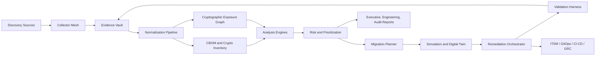

# Next-Generation PQC Migration Platform Blueprint

Date: 2026-06-03

Purpose: design a substantially stronger solution than the sample report generator: a full-stack cryptographic exposure, crypto-agility, and post-quantum cryptography (PQC) migration platform that can discover, assess, plan, remediate, validate, and continuously govern cryptography across enterprise infrastructure.

Working name: **Quantum Migration Fabric (QMF)**.

## 1. North Star

QMF should answer four questions continuously:

1. Where is cryptography actually used?
2. Which uses are weak, misconfigured, unknown, unmanaged, non-compliant, or quantum-vulnerable?
3. What exact migration path gets each system to a hybrid/PQC-safe state with minimum outage and provable rollback?
4. Can we prove, with evidence, that the environment is safer after migration and remains safe?

The sample report is mostly a network/TLS-centered readiness report. QMF should be a full cryptographic operating model: discovery plus inventory plus graph plus policy plus remediation plus validation plus audit evidence.

## 2. Guiding Principles

- **Evidence first**: every claim must link to a raw observation, parser, timestamp, scanner version, confidence score, and evidence hash.
- **No raw secrets by default**: memory/key inspection must avoid collecting private keys, session keys, plaintext, passwords, tokens, or decrypted payloads. The default mode records metadata, handles, lifetimes, storage location, algorithm, key size, exportability, and HMAC fingerprints using a tenant-local secret.
- **Runtime truth beats declared configuration**: configs, code, and inventories are useful, but final posture must be validated against live behavior.
- **Separate cryptographic roles**: never conflate KEM/key exchange, digital signature, certificate public key, certificate signature, symmetric encryption, hash, MAC, KDF, random generation, key storage, and protocol negotiation.
- **Hybrid first, PQC-only later**: for most enterprise protocols, use hybrid classical + PQC during transition, then retire classical-only paths when ecosystem readiness permits.
- **Graph-native**: crypto risk is a dependency problem. Keys, certificates, libraries, services, owners, data classes, vendors, clients, trust stores, and change windows must be connected.
- **Crypto-agility as product behavior**: applications should move from hardcoded algorithms to policy-driven cryptographic intents.
- **Build for unknowns**: unknown crypto is itself a finding until proven safe or irrelevant.

## 3. Standards and Migration Baseline

Current PQC baseline:

- **ML-KEM / FIPS 203**: primary PQC key-establishment/KEM standard.
- **ML-DSA / FIPS 204**: primary PQC digital-signature standard.
- **SLH-DSA / FIPS 205**: stateless hash-based digital-signature standard, useful where conservative assumptions matter despite larger/slower signatures.
- **Hybrid TLS 1.3**: IETF TLS work defines hybrid mechanisms including `X25519MLKEM768`, `SecP256r1MLKEM768`, and `SecP384r1MLKEM1024`.
- **OpenSSL 3.5+**: native support for ML-KEM, ML-DSA, SLH-DSA and hybrid ML-KEM in TLS 1.3.
- **Open Quantum Safe**: still valuable for lab/testing, provider-based OpenSSL integration, X.509/S-MIME experiments, and interoperability.
- **SSH/SFTP**: OpenSSH has shipped post-quantum hybrid key agreement by default since 9.0 via `sntrup761x25519-sha512`; newer SSH ecosystems are adding ML-KEM hybrids such as `mlkem768x25519-sha256`.
- **IKEv2/IPsec**: RFC 9370 supports multiple key exchanges for hybrid post-quantum IKEv2; strongSwan and major vendors are moving toward ML-KEM hybrid support.
- **CBOM**: CycloneDX CBOM should be the main interchange format for cryptographic inventory.

Primary guidance sources:

- NIST NCCoE Migration to PQC: https://www.nccoe.nist.gov/applied-cryptography/migration-to-pqc
- NIST FIPS 203: https://csrc.nist.gov/pubs/fips/203/final
- NIST CSWP 39 crypto agility: https://csrc.nist.gov/pubs/cswp/39/considerations-for-achieving-cryptographic-agility/final
- NIST SP 1800-38 cryptographic discovery: https://csrc.nist.gov/pubs/sp/1800/38/iprd-%281%29
- CISA/NSA/NIST quantum readiness: https://www.cisa.gov/resources-tools/resources/quantum-readiness-migration-post-quantum-cryptography
- CycloneDX CBOM: https://www.cyclonedx.org/capabilities/cbom/

## 4. Entity Coverage

QMF should treat every cryptographic touchpoint as a first-class entity.

| Domain | Entities to discover | Example evidence |
|---|---|---|
| Source code | Crypto API calls, algorithm strings, key generation, random generation, JWT/JWS/JWE, custom crypto, hardcoded secrets, certificate validation, pinning, trust manager bypasses | File path, line, AST/dataflow path, call graph, sink/source, rule ID |
| Binaries | PE/ELF/Mach-O, shared libs, APK/IPA, JAR/WAR/EAR, .NET assemblies, firmware, containers, statically linked crypto, symbol/import usage, constants, strings, code-signing signatures | Imports, symbols, strings, disassembly features, YARA/capa hits, library fingerprints |
| Runtime processes | Actual loaded libraries, negotiated algorithms, crypto API calls, key handles, key lifetime, RNG calls, library version, process owner | eBPF/uprobe, ETW, DTrace, JVM/JVMTI, Frida, OpenTelemetry, process maps |
| Memory and key residency | In-memory private keys, session keys, TLS secrets, HSM/KMS handles, exportability, plaintext key material presence, key zeroization behavior | Metadata-only by default: type, algorithm, process, lifespan, HMAC fingerprint, never raw key |
| Network | TLS/SSL, QUIC, SSH/SFTP/SCP, IPsec/IKE, OpenVPN/WireGuard, SMTP/IMAP/POP3 STARTTLS, LDAP/LDAPS, MQTT, AMQP, Kafka, database TLS, RDP, SMB, OT protocols | Handshake transcript, protocol version, cipher suite, group/KEX, cert chain, JA3/JA4, SNI |
| PKI and CLM | CAs, issuing templates, certificate profiles, SANs, revocation, OCSP/CRL, ACME, expiry, duplicate certs, wildcard certs, public/private trust stores | CA API, CT logs, network scans, keystore scans, trust store diff |
| Keys and keystores | JKS, PKCS#12, PEM, OpenSSH keys, Windows CNG/CAPI, macOS Keychain, Android Keystore, iOS Keychain, TPM, PKCS#11, HSM, KMS, Vault, cloud secrets | Key metadata, algorithm, size, origin, rotation age, export policy, HSM slot/key ID |
| Cloud and SaaS | Load balancers, CDN, WAF, API gateways, KMS, Secrets Manager, managed DB TLS, object storage encryption, service mesh, identity services | Cloud API config, managed certs, policy, live endpoint validation |
| Storage and backup | TDE, disk encryption, object encryption, database column crypto, backup encryption, archive retention, envelope encryption | Config/API, key IDs, KMS references, retention, data classification |
| Identity and auth | Kerberos, LDAP, SAML/OIDC, OAuth signing, JWT algorithms, WebAuthn/FIDO, SSH certs, mTLS, code signing, artifact signing | Token headers, cert chain, signing alg, key IDs, issuer, client population |
| CI/CD and supply chain | Git history, secrets, signing keys, Sigstore, Cosign, SLSA provenance, package signatures, SBOM/CBOM, build images | Build logs, repos, artifacts, signature metadata, SBOM/CBOM |
| Mobile, IoT, OT | APK/IPA, embedded firmware, boot chains, OTA update signatures, constrained TLS/DTLS, vendor libraries, long device lifetimes | Firmware unpacking, static/dynamic mobile instrumentation, SBOM/HBOM, protocol probes |
| Third parties | Vendor products, appliances, API dependencies, SaaS endpoints, customer integrations | Vendor questionnaire, external scans, contract evidence, product PQC readiness |

## 5. Platform Architecture

### 5.1 Collector Mesh

Collectors should be plugin-based and signed. Each collector emits structured evidence, never final truth. Core collector families:

| Collector | Function |
|---|---|
| Active network scanner | Safe probing for TLS, SSH, SFTP, IKE/IPsec, QUIC, STARTTLS, database TLS, service banners, certificate chains. |
| Passive network sensor | Zeek/Suricata/pcap/eBPF packet metadata for live protocol use, client compatibility, unknown services, drift. |
| Source analyzer | AST/dataflow/CodeQL/Semgrep/CogniCrypt/CryptoGuard adapters plus custom PQC-aware rules. |
| Binary analyzer | PE/ELF/Mach-O/APK/IPA/JAR/.NET/firmware unpacking; symbol/import/string/constant/function fingerprinting; Ghidra/capa/YARA/ML-assisted classifiers. |
| Runtime analyzer | eBPF uprobes, ETW, DTrace, JVM/JVMTI, .NET profiler, Frida for lab/mobile, LD_PRELOAD only in test, OpenTelemetry attributes. |
| Memory/key analyzer | Safe key residency and lifecycle proof; raw-key extraction only in restricted forensic mode with explicit approval and local-only handling. |
| Config parser | Nginx, Apache, Envoy, HAProxy, F5, Istio, Linkerd, OpenSSL, Java security, SSHD, strongSwan, cloud LB policies, DB configs. |
| PKI/CLM connector | DigiCert, Keyfactor, AppViewX, Venafi, Microsoft AD CS, EJBCA, ACME, private CAs, CT logs. |
| Cloud connector | AWS, Azure, GCP APIs for KMS, cert managers, LBs, CDNs, WAFs, service mesh, DBs, storage, IAM. |
| KMS/HSM connector | AWS KMS, Azure Key Vault/Managed HSM, GCP Cloud KMS, HashiCorp Vault, PKCS#11, KMIP, Thales, Entrust, YubiHSM. |
| SBOM/CBOM connector | CycloneDX, SPDX, Syft/cdxgen, Dependency-Track, artifact registries. |
| CMDB/IAM/GRC connector | Ownership, criticality, data class, business service, legal jurisdiction, exceptions, approvals. |

### 5.2 Evidence Vault

Evidence objects must be immutable and content-addressed.

Minimum fields:

- `evidence_id`
- `source_type`
- `source_tool`
- `source_version`
- `target`
- `collection_time`
- `raw_artifact_hash`
- `normalized_claims`
- `parser_version`
- `confidence`
- `sensitivity_class`
- `retention_policy`
- `redaction_policy`
- `chain_of_custody`

For memory/runtime observations:

- Store key metadata, not key bytes.
- Store HMAC fingerprints generated with a per-tenant vault key if correlation is needed.
- Support "forensic mode" only with just-in-time approval, local encrypted storage, short retention, audit trail, and legal hold controls.

### 5.3 Normalization and Algorithm Registry

The platform needs a canonical cryptographic registry:

- Aliases: `Kyber768`, `ML-KEM-768`, `X25519MLKEM768`, vendor-specific names.
- Role: KEM, KEX, signature, cert signature, symmetric cipher, AEAD, hash, MAC, KDF, RNG, key wrapping, storage encryption.
- Status: approved, legacy, deprecated, prohibited, quantum-vulnerable, hybrid, PQC-ready, experimental.
- Standards mapping: FIPS, NIST SP, RFC/IETF draft, CNSA 2.0, organizational policy.
- Implementation mapping: OpenSSL, BoringSSL, AWS s2n-tls, Go crypto/tls, rustls, NSS, Schannel, SymCrypt, Java/JCA, wolfSSL, mbedTLS, Botan, Bouncy Castle.
- Migration candidate: e.g. RSA/ECDH key establishment -> hybrid X25519 + ML-KEM-768 where protocol supports it; RSA/ECDSA signatures -> ML-DSA/SLH-DSA pilot or dual-signature/composite strategy where available.

## 6. Analysis Engines

### 6.1 Classical Crypto Misconfiguration Engine

Find:

- SSLv2/v3, TLS 1.0/1.1, weak TLS 1.2 policies.
- Weak ciphers, CBC where not acceptable, RC4, 3DES, NULL/EXPORT suites.
- SHA-1/MD5 signatures and hashes in sensitive contexts.
- RSA below policy threshold, weak DH groups, static DH, weak EC curves.
- Invalid chains, expired certs, missing SAN, weak revocation, OCSP/CRL issues.
- Wildcard overuse, duplicate certificates, duplicate private keys.
- Hardcoded keys, static IVs, ECB/CBC misuse, unauthenticated encryption, weak KDFs, weak RNG.
- Broken certificate validation, permissive trust managers, pinning mistakes.
- Cleartext protocol exposure and downgrade/fallback risks.

### 6.2 Quantum Exposure Engine

Classify each use:

| Crypto role | Quantum risk | Migration target |
|---|---|---|
| RSA/ECDH/DH key establishment | High for HNDL confidentiality | Hybrid ML-KEM + classical KEX, then PQC-only when mature |
| RSA/ECDSA/DSA signatures | Future forgery risk | ML-DSA or SLH-DSA, often dual/composite or staged via private PKI |
| Symmetric AES-128 | Usually acceptable short/medium term, but policy-dependent | AES-256 for long-lived high-value data |
| Hash SHA-256 | Generally okay, but collision/security margin context matters | SHA-384/SHA-512/SHA-3 for high assurance where required |
| HMAC/KDF | Usually less urgent than public-key migration | Review key length and algorithm policy |
| Random generation | Critical regardless of PQC | Strong OS/HSM RNG, entropy monitoring |

Risk inputs:

- Data confidentiality lifetime.
- Exposure type: public internet, internal, partner, OT, air-gapped, backup/archive.
- Adversary model: HNDL, nation-state, insider, supply chain.
- Asset criticality and business owner.
- Algorithm role and key size.
- Runtime and client compatibility.
- Existing compensating controls.
- Evidence confidence.

### 6.3 Crypto-Agility Engine

Score each asset on:

- Algorithms are hardcoded vs policy-driven.
- Crypto library is old vs current and supported.
- Protocol supports algorithm negotiation safely.
- Keys/certs can rotate without downtime.
- PKI/KMS/HSM supports new key types.
- Clients can handle larger keys, signatures, certificates, handshake messages.
- Automated tests exist for cryptographic behavior.
- Rollback is defined and tested.

### 6.4 Dependency and Blast Radius Engine

Graph queries must answer:

- If this certificate/key/CA/template changes, what breaks?
- Which clients actually negotiate with this service?
- Which services share the same private key?
- Which data with retention over N years depends on quantum-vulnerable key exchange?
- Which trust stores lack the future CA chain?
- Which vendor appliances block migration?
- Which change should happen first to reduce the most HNDL risk with least outage?

### 6.5 Compliance and Claimability Engine

Separate technical posture from legal claims.

- Technical: evidence says a control is implemented and validated.
- Compliance: framework applicability is triggered.
- Claimability: evidence, legal review, data classification, transfer/residency, exception expiry, and executive signoff are complete.

This avoids the sample report problem of over-claiming readiness when evidence gates are incomplete.

## 7. Runtime and Memory Analysis Design

This is the differentiating layer. It must be powerful but safe.

### 7.1 Modes

| Mode | Purpose | Secret handling |
|---|---|---|
| Metadata mode | Default production mode. Discover crypto operations, key handles, algorithm, key size, lifespan, library, process, endpoint. | No raw secrets or plaintext. |
| Fingerprint mode | Correlate key reuse or long-lived keys across processes/hosts. | HMAC/private fingerprint only; tenant-local key; no reversible key data. |
| Lab instrumentation mode | Deep tracing in staging/mobile lab to understand app behavior. | Controlled capture, synthetic data preferred. |
| Forensic mode | Incident response or authorized deep audit. | Raw secrets possible only with explicit approval, local sealed storage, short retention, complete audit. |

### 7.2 Linux Runtime Sensors

- eBPF uprobes on OpenSSL/BoringSSL/LibreSSL/GnuTLS/NSS/wolfSSL functions.
- Go `crypto/tls` and rustls symbol-aware probes where possible.
- Process memory maps to determine loaded crypto libraries and versions.
- `/proc` and package-manager correlation.
- Kernel crypto API tracing for IPsec/disk where relevant.
- OpenTelemetry TLS attributes for normalized telemetry.

Useful patterns from research/tooling:

- eBPF can attach to `SSL_read` and `SSL_write` for TLS observability; QMF should adapt this to collect metadata by default rather than plaintext.
- bpftrace/bcc uprobes provide a proven mechanism, but function signatures differ by library/version, so QMF needs a version-aware probe catalog.

### 7.3 Windows Runtime Sensors

- ETW providers for Schannel/CNG/CAPI events where available.
- CNG/KSP/key isolation metadata.
- Certificate store and private-key provider mapping.
- Process module inspection for OpenSSL/BoringSSL/NSS embedded in Windows apps.
- LSASS/CNG memory inspection only in forensic mode, never routine production.

### 7.4 macOS/iOS/Android Runtime Sensors

- macOS Keychain, Secure Enclave metadata, Network.framework/Secure Transport where available.
- Android Keystore, Conscrypt/BoringSSL, Java Cryptography Architecture, OkHttp.
- iOS Keychain/Secure Enclave/CommonCrypto/CryptoKit metadata.
- Frida/Objection-style instrumentation only in test labs or managed app assessment, not broad production monitoring.

### 7.5 Key Lifecycle Findings

Detect:

- Key material present in application memory when HSM/KMS should be used.
- Long-lived session keys.
- Keys not zeroized after use.
- Exportable keys where non-exportable policy is required.
- Private keys copied outside approved keystore/HSM.
- Same key reused across environments.
- Rotation age beyond policy.
- Missing renewal automation.
- Algorithms blocked from PQC migration due to HSM/KMS/PKI limitations.

## 8. Migration Planner

### 8.1 State Machine

Each asset moves through:

1. `unknown`
2. `inventoried`
3. `classified`
4. `risk-scored`
5. `migration-candidate-selected`
6. `compatibility-checked`
7. `change-plan-approved`
8. `canary-enabled`
9. `production-enabled`
10. `classical-only-retired`
11. `validated`
12. `continuously-monitored`

### 8.2 Protocol Playbooks

| Area | Near-term migration | Later migration |
|---|---|---|
| TLS/HTTPS/API/mTLS | TLS 1.3, hybrid `X25519MLKEM768` where supported, modern classical fallback, telemetry on client compatibility | PQC-only KEX where standards and clients mature; PQ signatures in cert chains |
| Certificates/PKI | Shorter lifetimes, automate renewal, private PKI pilots for ML-DSA/SLH-DSA, dual/composite where ecosystem supports | Public/private CA support for PQ signatures and PQ-aware validation |
| SSH/SFTP/SCP | Enable OpenSSH PQ hybrid KEX, verify `sntrup761x25519-sha512` or `mlkem768x25519-sha256`; update clients | PQ/dual signatures for SSH certs and signing when standardized |
| IPsec/IKE/VPN | RFC 9370-style hybrid IKEv2 with ML-KEM where vendor supports; PSK mixing where appropriate | Standardized ML-KEM profiles broadly across appliances |
| QUIC/HTTP3 | Same TLS 1.3 hybrid group strategy; verify QUIC stack support | PQC-only when client ecosystem supports |
| Email/S/MIME/PGP | Pilot OQS/OpenSSL S/MIME and GnuPG PQC capabilities in internal/closed groups | Ecosystem-wide PQ certificates and message formats |
| Code signing | Inventory keys and algorithms; pilot dual signatures or parallel attestations | PQ signatures in signing ecosystems and artifact verifiers |
| JWT/OIDC/SAML | Inventory signing algorithms and libraries; avoid weak RSA/ECDSA params; plan larger signature support | ML-DSA/SLH-DSA support when JOSE/SAML libraries and standards mature |
| Storage/backups | AES-256, robust envelope encryption, KMS/HSM-backed keys, rotate old keys protecting long-lived data | PQC for key wrapping/exchange where KMS vendors support it |
| Firmware/IoT/OT | Inventory update signatures, boot chains, device lifetime, memory limits; test ML-DSA/SLH-DSA feasibility | Device refresh or bootloader updates for PQ signature verification |
| Kerberos/AD | Inventory crypto types and PKINIT/cert usage; harden classical crypto | Vendor-led PQC transitions in Windows/AD CS/CNG and related protocols |

### 8.3 Remediation Output

For each migration item, output:

- Current evidence.
- Exact risk reason.
- Target state.
- Prerequisites.
- Client compatibility impact.
- Generated config or pull request.
- Canary plan.
- Validation commands.
- Rollback plan.
- Owner and approver.
- Change window.
- Residual risk.
- Evidence required for closure.

## 9. Digital Twin and Simulation

Before making changes, QMF should simulate:

- Certificate replacement impact by trust store/client population.
- TLS policy changes by real client telemetry.
- SSH/SFTP KEX changes by known client versions.
- IPsec/IKE changes by peer appliance capabilities.
- Key rotation impact by dependency graph.
- HSM/KMS throughput and PQC operation latency.
- MTU/fragmentation risk due to larger PQC handshakes/signatures.
- Database/storage re-encryption windows.
- Rollback feasibility.

The output should be a migration wave plan, not just a list of findings.

## 10. Reporting Model

Generate different views from the same evidence:

| Audience | View |
|---|---|
| CISO/Board | Quantum risk, crown-jewel exposure, HNDL exposure, migration budget, timeline, exceptions |
| Security engineering | Findings, evidence, remediation, validation, blockers |
| Platform/SRE | Config changes, canaries, rollback, runtime compatibility |
| Developers | Code locations, safer API replacements, CI/CD gates, PRs |
| PKI team | cert/key inventory, CA templates, renewal plan, duplicate keys, trust stores |
| Legal/GRC | claimability, jurisdiction triggers, data classes, evidence completeness |
| Auditors | CBOM, evidence hashes, policy decisions, approvals, validation results |

## 11. Data Model

Minimum graph node types:

- `Org`, `BusinessService`, `Application`, `Repository`, `Artifact`, `Binary`, `ContainerImage`, `Firmware`
- `Host`, `Process`, `Library`, `Runtime`, `Endpoint`, `NetworkFlow`
- `Protocol`, `ProtocolConfig`, `CipherSuite`, `NamedGroup`, `Algorithm`, `CryptoOperation`
- `Certificate`, `CA`, `TrustStore`, `PrivateKey`, `PublicKey`, `KeyHandle`, `Keystore`, `HSM`, `KMS`
- `DataAsset`, `DataClass`, `RetentionRequirement`, `Jurisdiction`
- `Finding`, `RiskScenario`, `PolicyRule`, `Evidence`, `Exception`
- `Remediation`, `MigrationWave`, `Change`, `Validation`, `Rollback`
- `Owner`, `Team`, `Vendor`, `ClientPopulation`

Minimum edge types:

- `contains`, `loads`, `calls_crypto`, `uses_algorithm`, `negotiates`, `terminates`, `protects`
- `uses_certificate`, `issued_by`, `trusted_by`, `has_private_key`, `stored_in`, `backed_by_kms`
- `belongs_to`, `owned_by`, `depends_on`, `called_by`, `exposes_data`, `has_client`
- `has_finding`, `evidenced_by`, `violates`, `blocked_by`, `remediated_by`, `validated_by`

## 12. Technology Stack

Recommended implementation stack:

| Layer | Suggested options |
|---|---|
| Collector runtime | Go/Rust agents, Python adapters for analysis tools, Kubernetes Jobs, serverless scans |
| Active network | Nmap, ZGrab2, SSLyze, testssl.sh, ssh-audit, ike-scan, custom QUIC/STARTTLS probes |
| Passive network | Zeek, Suricata, Arkime, eBPF metadata probes |
| Source analysis | CodeQL, Semgrep/Opengrep, CogniCrypt/CrySL, CryptoGuard, tree-sitter, custom Code Property Graph |
| Binary analysis | capa, YARA, Ghidra headless, rizin/radare2, Syft, custom crypto-constant/function classifier |
| Runtime | eBPF/bcc/libbpf, ETW, DTrace, JVMTI, .NET profiler, Frida in labs |
| Inventory | CycloneDX CBOM, SBOM, PostgreSQL |
| Graph | Neo4j, JanusGraph, or Amazon Neptune; OpenSearch for evidence search |
| Policy | OPA/Rego plus internal crypto registry |
| Orchestration | Temporal or Airflow, Kubernetes, GitOps, Jira/ServiceNow integrations |
| PQC lab | OpenSSL 3.5+, Open Quantum Safe, oqs-provider, strongSwan, OpenSSH, nginx/Envoy/HAProxy testbed |
| Reporting | Markdown/PDF renderer, dashboard, Mermaid/graph visualization, signed audit bundles |

## 13. Build Roadmap

### Phase 0: Architecture and Golden Dataset, 2-4 weeks

- Define the canonical crypto evidence schema and graph model.
- Build a golden testbed with known weak, classical, hybrid, and PQC cases.
- Define policy registry for algorithms and migration paths.
- Create a threat model and data-handling design for memory/key telemetry.

### Phase 1: Inventory MVP, 6-10 weeks

- Implement active TLS/SSH/SFTP/STARTTLS scanning.
- Implement certificate and trust-chain parser.
- Add Nmap/ZGrab2/SSLyze/testssl.sh adapters.
- Add source scanning via Semgrep/CodeQL.
- Emit CycloneDX CBOM and graph nodes.
- Produce a report that fixes the sample report weaknesses: no contradictory evidence, no role conflation.

### Phase 2: Full Discovery, 3-5 months

- Add config parsers for web servers, service mesh, load balancers, SSHD, IKE/IPsec, Java/OpenSSL policies.
- Add binary/package/container/firmware scanning.
- Add cloud/KMS/HSM/PKI/CLM connectors.
- Add passive network sensor.
- Add data classification and owner integrations.

### Phase 3: Runtime and Memory-Safe Telemetry, 5-8 months

- Linux eBPF metadata probes for OpenSSL/BoringSSL/Go/rustls where feasible.
- Windows ETW/CNG/Schannel metadata connectors.
- JVM/.NET/mobile lab instrumentation.
- Key residency/lifetime findings with secret-safe fingerprints.
- Forensic mode governance and local-only handling.

### Phase 4: Migration Planner and Orchestrator, 8-12 months

- Generate migration waves from graph centrality, data lifetime, compatibility, and change risk.
- Generate config diffs/PRs for TLS, SSH, IPsec, PKI templates, cloud LB policies.
- Add canary, rollback, and validation transactions.
- Add Jira/ServiceNow/GitHub/GitLab integrations.

### Phase 5: Continuous Crypto Governance, 12+ months

- CI/CD gates: block new weak/classical-only crypto.
- Runtime drift detection.
- Compliance claimability engine.
- Executive risk burn-down and audit package export.
- Vendor readiness and third-party attestation workflows.

## 14. What Would Make This Better Than Existing Platforms

1. **True full-stack coverage**: source, binary, runtime, memory, network, cloud, PKI, KMS/HSM, storage, identity, mobile, IoT, OT.
2. **Secret-safe runtime discovery**: prove key lifecycle problems without routinely collecting secrets.
3. **Role-correct PQC reasoning**: no ML-KEM-for-cert-signature mistakes.
4. **CBOM-native evidence graph**: not a dashboard bolted onto scanner output.
5. **Migration digital twin**: simulate blast radius before changing crypto.
6. **Automated remediation with validation**: PR/config/ticket/canary/rollback, not only advice.
7. **Client compatibility telemetry**: real usage tells when classical fallback can be retired.
8. **Crypto intent abstraction**: "protect data for 15 years" maps to policy-backed algorithm choices.
9. **Regulatory claimability**: technical remediation and legal/compliance claims remain separate.
10. **Continuous drift control**: crypto posture becomes an operational control, not an annual assessment.

## 15. Immediate Design Decisions

| Decision | Recommendation |
|---|---|
| Data interchange | CycloneDX CBOM plus internal graph schema. |
| Default PQC migration style | Hybrid first for network protocols. |
| TLS target | TLS 1.3 with `X25519MLKEM768` where supported, modern classical fallback during transition. |
| SSH/SFTP target | Enable/validate OpenSSH PQ hybrid KEX, especially `sntrup761x25519-sha512` and `mlkem768x25519-sha256` where supported. |
| IPsec target | RFC 9370-compatible hybrid IKEv2 with ML-KEM when supported. |
| Certificates | Automate lifecycle now; pilot ML-DSA/SLH-DSA in private PKI; track ecosystem readiness for public trust. |
| Runtime scanning | Metadata-only by default; raw secret capture only under forensic approval. |
| Graph backend | Start with Neo4j for speed of development; abstract graph queries to allow JanusGraph/Neptune later. |
| Policy engine | OPA/Rego plus a versioned crypto registry. |
| First MVP scope | Network + cert + source + config + CBOM + graph + report, then runtime/memory. |

## 16. Research and Tool References

Standards and guidance:

- NIST NCCoE Migration to PQC: https://www.nccoe.nist.gov/applied-cryptography/migration-to-pqc
- NIST SP 1800-38: https://csrc.nist.gov/pubs/sp/1800/38/iprd-%281%29
- NIST CSWP 39: https://csrc.nist.gov/pubs/cswp/39/considerations-for-achieving-cryptographic-agility/final
- CISA/NSA/NIST quantum readiness: https://www.cisa.gov/resources-tools/resources/quantum-readiness-migration-post-quantum-cryptography
- AIVD/CWI/TNO PQC Migration Handbook: https://english.aivd.nl/documents/publications/2024/12/03/the-pqc-migration-handbook
- GSMA Post Quantum Telco Impact Assessment: https://www.gsma.com/newsroom/wp-content/uploads/PQ.1-Post-Quantum-Telco-Network-Impact-Assessment-Whitepaper-Version1.0.pdf

Protocols and implementations:

- IETF ECDHE-MLKEM TLS draft: https://datatracker.ietf.org/doc/draft-ietf-tls-ecdhe-mlkem/
- OpenSSL 3.5 PQC: https://openssl.foundation/news/the-features-of-3-5-post-quantum-cryptography
- OpenSSL hybrid ML-KEM: https://openssl.foundation/news/the-features-of-3-5-hybrid-ml-kem
- Open Quantum Safe TLS: https://openquantumsafe.org/applications/tls.html
- Open Quantum Safe X.509: https://openquantumsafe.org/applications/x509.html
- Cloudflare PQC TLS docs: https://developers.cloudflare.com/ssl/post-quantum-cryptography/
- AWS KMS hybrid post-quantum TLS: https://docs.aws.amazon.com/kms/latest/developerguide/pqtls.html
- Microsoft AD CS PQC overview: https://learn.microsoft.com/en-us/windows-server/identity/ad-cs/post-quantum-cryptography-overview
- OpenSSH PQC: https://www.openssh.org/pq.html
- RFC 9941 SSH hybrid sntrup761/x25519: https://www.rfc-editor.org/rfc/rfc9941.html
- RFC 9370 IKEv2 multiple key exchanges: https://www.ietf.org/rfc/rfc9370.html
- strongSwan PQC support: https://strongswan.org/

Discovery, source, binary, runtime:

- CycloneDX CBOM: https://www.cyclonedx.org/capabilities/cbom/
- CodeQL weak crypto query: https://codeql.github.com/codeql-query-help/python/py-weak-cryptographic-algorithm/
- Semgrep rules: https://semgrep.dev/docs/running-rules/
- CogniCrypt/CrySL: https://eclipse.dev/cognicrypt/documentation/codeanalysis/
- CryptoGuard: https://github.com/CryptoGuardOSS/cryptoguard
- SSLyze: https://github.com/nabla-c0d3/sslyze
- testssl.sh: https://github.com/testssl/testssl.sh
- ZGrab2: https://github.com/zmap/zgrab2
- capa: https://mandiant.github.io/capa/
- Ghidra: https://github.com/NationalSecurityAgency/ghidra
- Volatility: https://github.com/volatilityfoundation/volatility
- bpftrace user probes: https://bpftrace.org/hol/user-probes
- Pixie eBPF OpenSSL tracing: https://blog.px.dev/ebpf-openssl-tracing/
- bcc sslsniff: https://manpages.ubuntu.com/manpages/bionic/en/man8/sslsniff-bpfcc.8.html
- OpenTelemetry TLS attributes: https://opentelemetry.io/docs/specs/semconv/registry/attributes/tls/

Research:

- Software-defined cryptography: https://arxiv.org/abs/2404.01808
- PQC migration dependency framework: https://arxiv.org/abs/2307.06520
- Toolchain for executable PQC migration: https://arxiv.org/abs/2409.07852
- Operationalising Post Quantum TLS: https://arxiv.org/abs/2605.17955
- Study of PQC status of widely used protocols: https://arxiv.org/abs/2603.28728
- PQC support in crypto libraries survey: https://arxiv.org/abs/2508.16078
- Quantum-safe software engineering vision: https://arxiv.org/abs/2602.05759
