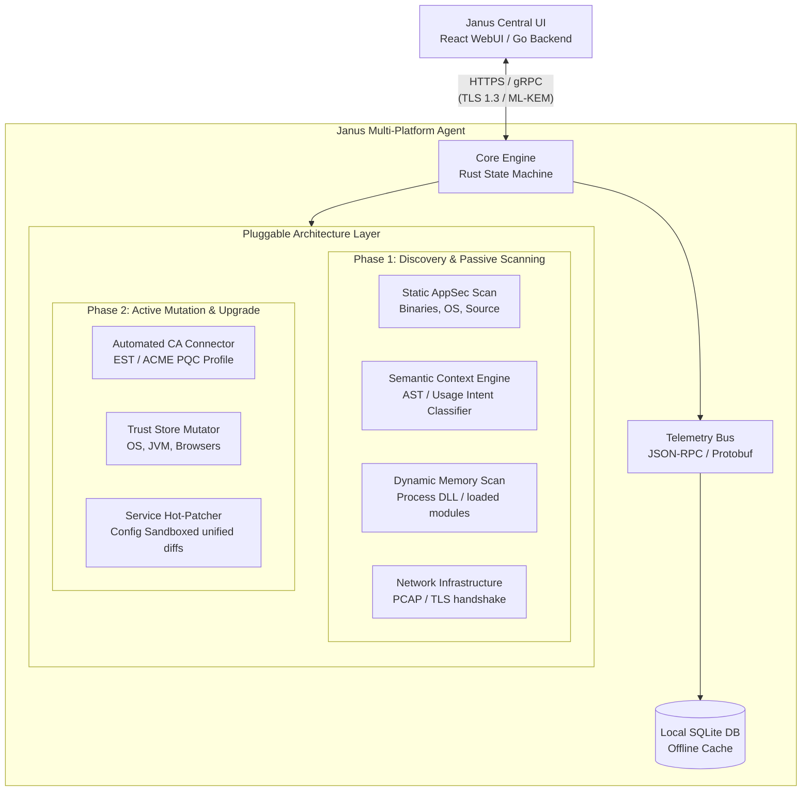
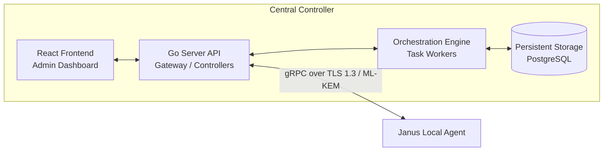
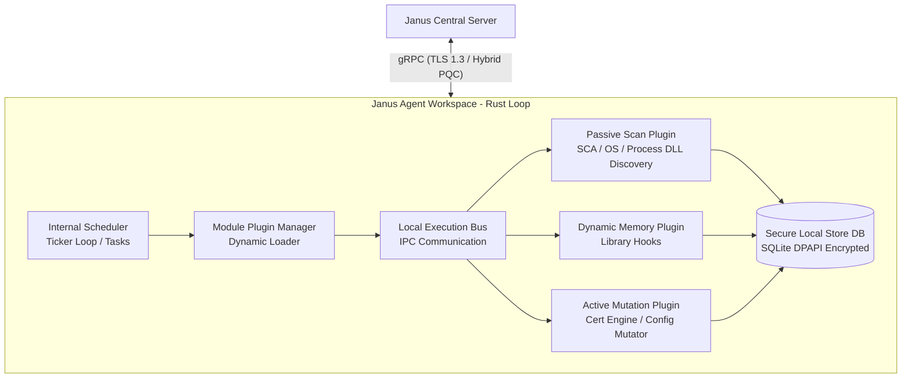

## Janus CryptoBOM


* Janus CryptoBOM is an enterprise-grade, post-quantum cryptographic posture management, discovery, and automated migration suite. This document serves as the foundational technical blueprint for building the multi-tier platform.

------------------------------
## 1. Functional & Technical Requirements


## 1.1 Discovery & Passive Mapping

* Cryptographic Bill of Materials (CBOM) Generation: Multi-language source code scanning (C/C++, Go, Rust, Java, Python, .NET) to construct a valid CycloneDX v1.6 CBOM with cryptographic extensions.
* Semantic Context Analysis: Heuristic usage-intent classification differentiating active cryptographic usage (protection) from verification-only or capability negotiation paths to eliminate false positives.
* Static Binary Analysis: Automated parsing of compiled assets (ELF, PE, Mach-O) to flag statically or dynamically linked cryptographic modules (OpenSSL, BoringSSL, LibreSSL, WolfSSL).
* Dynamic Runtime Memory Discovery: Live detection of running process cryptographic structures, ephemeral symmetric keys, and active session objects via non-intrusive memory mappings.
* Active Process DLL & Loaded Modules Auditing: Discovery of statically or dynamically linked DLLs and loaded libraries (e.g. `bcrypt.dll`, `openssl.dll`) inside running processes, capturing active cryptographic provider allocations.
* Network & Infrastructure Sweeper: Deep packet inspection and active port scanning to inventory cipher configurations across corporate infrastructure, SSH daemons, web servers, database endpoints, and appliances.
* OS/Hardware Cryptographic Asset Inventory: Mapping of underlying hardware components, including Hardware Security Modules (HSMs), Trusted Platform Modules (TPMs), and OS-native crypto abstractions (Windows CNG, macOS CryptoTokenKit, Linux /proc/sys/crypto).

## 1.2 Active Migration Orchestration

* Local CA Integration / Automation Protocol Link: Direct programmatic control over internal Certificate Authorities via automated protocols (ACME, EST, CMP), specifically requesting hybrid and post-quantum certificate profiles.
* Targeted Configuration Mutators: Scriptable execution modules capable of editing web server structures (Nginx, Apache), directory services, and network node configurations to enforce post-quantum rules.
* Sandboxed Unified Diff & Extension Guard: Enforces a strict file extension safety whitelist, restricting mutations to configuration files (`.conf`, `.config`, `.json`, `.toml`, `.yaml`, `.xml`) and validating file paths to prevent arbitrary system files from being overwritten.
* System and Environment Trust Store Enrollment: Direct automated insertion, rotation, and structural invalidation of trust chains across diverse operating system trust stores, custom Java Virtual Machine (cacerts) runtimes, and local browser keystores.
* Safe Hot-Patching / Service Restart Routines: Orderly execution strings to swap out local credentials, update daemon parameters, verify operational validity, and invoke graceful reloads of critical communication pipes without system degradation.

## 1.3 Non-Functional Requirements & Diagnostics

* Platform Neutrality: Native cross-compilation matching core agent operations flawlessly across targets: Linux (amd64, arm64), Windows (x86_64, arm64), macOS (Intel, Apple Silicon), and embedded runtime capability blocks for Android/iOS.
* Zero-Impact Operational Guardrails: CPU consumption caps strict at < 5% baseline capacity, storage caching footprints under 50MB locally, and zero memory leak tolerances implemented through precise compile-time memory bounds tracking.
* Local Cache Self-Maintenance: Automated database integrity validation (`PRAGMA integrity_check`) and space recovery (`VACUUM`) on the local SQLite offline cache to prevent storage fragmentation and excessive disk utilization.
* Startup Diagnostics & Self-Test Suite: Automatic environment inspection, database checkups, and network gRPC connection latency logging on daemon startup to verify operational readiness.
* Decoupled Operation Mode: Native fallback paths preserving fully sandboxed telemetry gathering routines if administrative modification authorization is absent.
* Air-Gapped Telemetry Survivability: Local high-speed, secure cache layers preserving metrics during long connectivity drops, syncing payloads via encrypted channels upon central connection recovery.

## 1.4 Enterprise Audit, Scoring & Observability

* Dynamic PQC Compliance Policy Studio: Real-time rules checking and scoring engine allowing custom compliance profiles (defining minimum key sizes, TLS 1.3 requirements, hybrid PQC requirements, and preferred signature/KEM algorithms) with visual dynamic grading.
* Context-Aware Confidence Scoring: Risk scoring that adapts based on the source of the finding, intelligently downgrading verification/negotiation usages and ignoring test-code artifacts.
* Live OSV.dev Integration: Automated cross-referencing of discovered libraries and components against the live OSV.dev vulnerability database to identify active CVEs in cryptographic implementations.
* Critical Telemetry Webhook Dispatcher: Asynchronous messaging pipelines for instantly sending critical cryptographic vulnerability findings to alert webhooks (like Slack, Teams, or custom alert targets).
* Telemetry Retention & Automated Purge Engine: Configurable duration threshold data lifecycles with automated background cleanup worker jobs and manual immediate database purging options.
* Structured SIEM & Audit Log Exporter: Native SIEM log schema serializer formatting operational logs and security telemetry events into standard JSON payloads optimized for Splunk/Elastic ingestion.
* High-Performance Prometheus Observability Endpoint: Standardized `/metrics` instrumentation exposing system health metrics, assets count, finding categorizations, and migration metrics.

------------------------------
## 2. Open-Source Component Selection & Integration Blueprint

```
+-------------------------------------------------------------------------------------------+

|                                    JANUS CODEBASE BASELINE                                |
+-------------------------------------------------------------------------------------------+

|      Component Task       |         Selected Open Source Base        |   Customization    |
+---------------------------+------------------------------------------+--------------------+

|  Core Scanning & CBOM     |  CycloneDX cdxgen / CDX Engine           | Native Rust Core   |
|  Memory Analysis Logic    |  Volatility 3 Framework Logic Core       | Extract Signature  |
|  Dynamic Process Intercept|  Frida Instrumentation Engine Core       | Agent JS-Bindings  |
|  Network Transport Bus    |  gRPC-Go Core Engine                     | Protobuf Layers    |
|  Network Telemetry Engine |  Libpcap Core C Library wrappers         | Flow Analyzers     |
|  Central UI Dashboard     |  Go-Fiber Web Framework / React SPA      | Web Console Suite  |
+-------------------------------------------------------------------------------------------+
```

## 2.1 Core Telemetry & Parsing Engines

* CycloneDX cdxgen Engine Core: Used as the metadata generation engine. Customize it by writing custom language parsers in Rust to output structural CBOM formats compliant with CycloneDX specifications.
* Volatility 3 Structural Algorithms: Extract specific patterns matching structural mathematical layouts for cryptographic key structures (such as RSA primes and AES key schedules). Port these logic algorithms into native Rust memory-carving loops.
* Frida Core Agent Injections: Embed the frida-core components into the agent's active execution engine. Leverage JavaScript runtime hooks to monitor critical crypto bindings within popular systems (e.g., Apple CommonCrypto, Microsoft CNG, OpenSSL APIs).

## 2.2 Transport, Network, & Storage Foundations

* gRPC Protocol Framework (Protobuf): Standardized communication transport layer. Ensure all client-to-server schema files enforce strict TLS 1.3 connections, pre-configured with early-stage post-quantum hybrid algorithm handshakes.
* Libpcap / Packet Interceptor Base: Utilize localized packet capture primitives on endpoints to isolate network handshake fields without altering active packet streams.
* SQLite Embedded Database Engine: Serves as the agent's offline storage layer. Configure it with strict hardware-isolated database encryption keys to protect scanned network telemetry data.

------------------------------
## 3. High-Level Architectural Design (HLD)## 3.1 Central Controller Architecture
The Central Server runs a high-performance Go backend coupled to a decoupled single-page React frontend console. It processes asymmetric JSON payloads and protobuf packets over gRPC pipelines.

## Storage Schema Essentials

* Asset Catalog: Inventories host topologies, operational platforms, infrastructure tiers, and agent connectivity cycles.
* CBOM Graph Datastore: Tracks cryptographic components, including algorithm properties, dependency hierarchies, key lengths, and compliance status.
* Migration Pipeline State Table: Coordinates real-time scheduling, software patching sequences, rollbacks, and verification logs.

The agent is written in Rust to guarantee low overhead and memory safety. It uses a decoupled modular design that runs completely in user space during Passive operations.

* **DPAPI Configuration & Secret Decryption Engine**: On Windows, the agent supports native Data Protection API (DPAPI) decryption of sensitive parameters (such as gRPC authentication keys or CA passwords). Decryption occurs dynamically in-memory on startup, protecting local agent configurations from raw credential exposure on the filesystem.

## 3.3 System Control Workflows## Network & Asset Processing Sequence

   1. The Central Server distributes a scheduler policy payload to the agent.
   2. The Local Core Engine verifies the file's digital signature and updates its active scan scope.
   3. The Passive Scanning engine crawls local source repositories, binary file locations, and system configuration directories.
   4. The agent matches structural findings against NIST post-quantum compliance criteria.
   5. Results are packaged into a standard CycloneDX CBOM format and synced to the central server via gRPC.

## Active Migration Sequence

   1. The system administrator selects a cluster of vulnerable hosts from the central interface and requests an upgrade to modern PQC standards (e.g., migrating an RSA configuration to ML-KEM).
   2. The Central Server issues an encrypted orchestration directive to the target agents.
   3. The Local Agent elevates its privileges, generates a localized backup of configuration files, and requests a post-quantum certificate from the configured Certificate Authority.
   4. The Mutation Plugin updates local server configuration files and registers the new PQC certificate chain across target system trust stores.
   5. The platform restarts the managed system service, runs an automated connection handshake test, and automatically rolls back configuration states if errors are detected.

------------------------------
